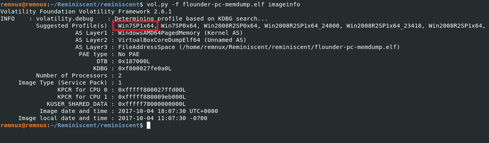
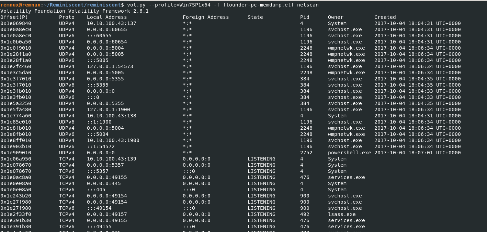
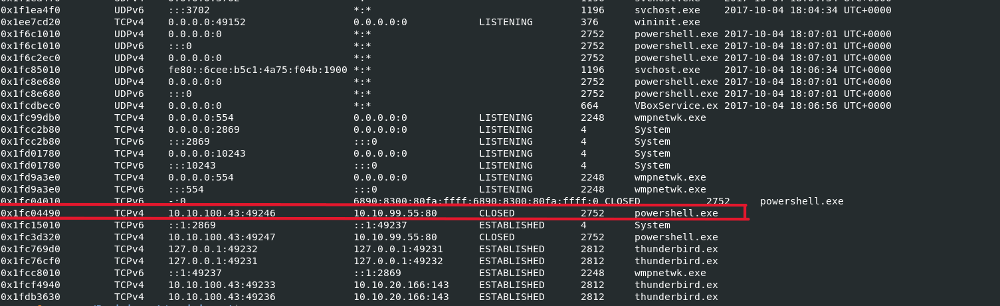
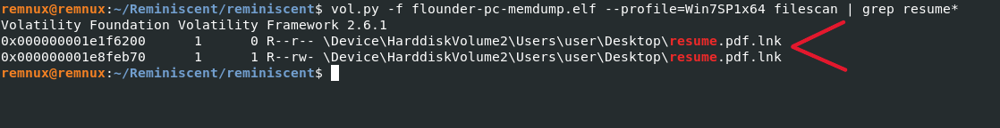
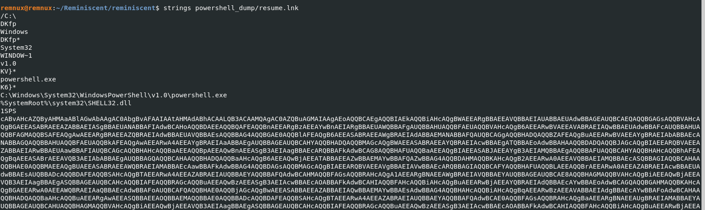
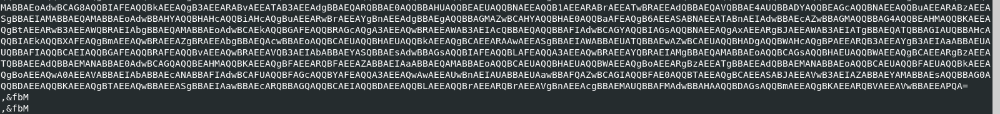
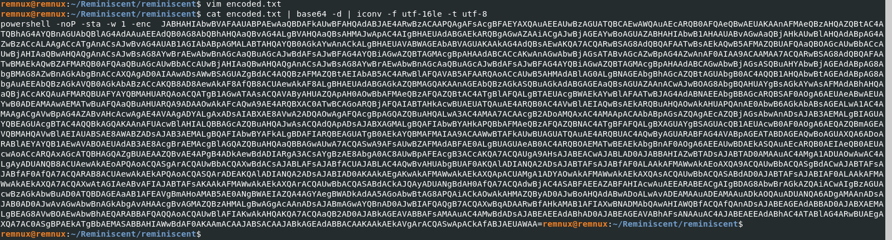
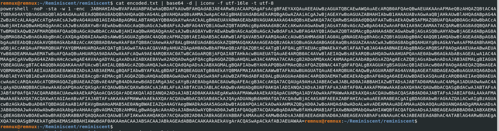
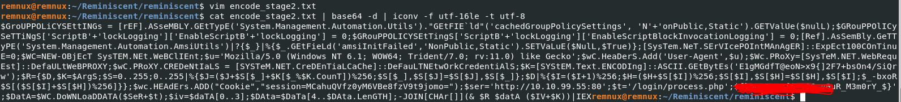

# Reminiscent HTB Challenge - Memory Dump Investigation

This is the write-up of the Reminiscent HTB challenge. After downloading and extracting the files, I began the analysis.

> Note: The file we are analyzing is **flounder-pc-memdump.elf** because it is our memory dump. The others are there to give you more information about the challenge.

---

## 📧 Resume Email Analysis

So, I began by reading the `Resume.eml` file to see what it contains. I read it carefully, including the embedded URLs. One happened to be:

```
http://10.10.99.55:8080/resume.zip
```

So I take note of the IP address and begin the analysis.

---

## 🧠 Profiling the Memory Dump

We have to know the profile of the memory dump provided before moving further, so I use **Volatility version 2**.



---

## 🔍 Checking Network Connections

After obtaining the profile, I begin to check the running processes and see whether the resume was downloaded and run, which might execute a malicious process. I use the `netscan` plugin for this because it provides us with the source and foreign address of the communication established.

```bash
volatility -f flounder-pc-memdump.elf --profile=Win7SP1x64 netscan
```




So from the above, I notice the IP address I found in the email link. It shows that the internal IP established a connection with the foreign IP and the process that was triggered is **powershell**. So from that, I got an idea that **powershell is involved** in this attack.

---

## 🗂️ Searching for the Resume File

Then I move on to see whether the resume file was installed/downloaded on the computer (I mean the HR computer). For that, I use the `filescan` plugin and `grep` the string `resume`, and I found that the resume was downloaded on the user's Desktop.

```bash
volatility -f flounder-pc-memdump.elf --profile=Win7SP1x64 filescan | grep -i resume
```



---

## 📤 Dumping the Resume File (.lnk)

So what's next is I use the `dumpfiles` plugin in Volatility to extract the `.lnk` file:

✅ `-Q` is the physical offset from `filescan`  
✅ `-D powershell_dump` is the directory where the dumped file will go

```bash
volatility -f flounder-pc-memdump.elf --profile=Win7SP1x64 dumpfiles -Q <OFFSET> -D powershell_dump
```

---

## 🔡 Strings Analysis

Then I run a `strings` command on the dumped file and I found an encoded string in it.

```bash
strings powershell_dump/resume.lnk
```




The string is very long; I did not capture the whole of it. But the above is the starting and the ending.

Therefore I found it’s a PowerShell command embedded in the `.lnk` file.  
That long string starting with `cABv...` looks like Base64-encoded UTF-16 PowerShell script (the mixed caps with lots of A, B, etc., is typical of UTF-16 Base64).

---

## 🧪 Decoding the First Stage Payload

So I decode the UTF-16 little-endian Base64 string via command line.  
It can also be done with Python as well.

```bash
cat encoded.txt | base64 -d | iconv -f utf-16le -t utf-8
```



After decoding, it still contains another Base64-encoded string (the part after `-enc`), which is the actual encoded PowerShell command. So I decoded again.

---

## 🔓 Decoding the Second Stage Payload

```bash
cat encode_stage2.txt | base64 -d | iconv -f utf-16le -t utf-8
```



After decoding the second stage, it’s a PowerShell payload which is obfuscated but now readable.

---

## 🏁 Finding the Flag

From that, I found the flag!



But I hide the flag in red. 😉

---

## ✅ Summary of Commands Used

```bash
# Identify memory profile
volatility -f flounder-pc-memdump.elf imageinfo

# Check network connections
volatility -f flounder-pc-memdump.elf --profile=Win7SP1x64 netscan

# Search for resume file
volatility -f flounder-pc-memdump.elf --profile=Win7SP1x64 filescan | grep -i resume

# Dump the .lnk file
volatility -f flounder-pc-memdump.elf --profile=Win7SP1x64 dumpfiles -Q <OFFSET> -D powershell_dump

# Extract strings
strings powershell_dump/resume.lnk

# Decode base64 UTF-16LE
cat encoded.txt | base64 -d | iconv -f utf-16le -t utf-8

# Decode second stage
cat encode_stage2.txt | base64 -d | iconv -f utf-16le -t utf-8
```

---


## 💡 Conclusion

This challenge is a clear demonstration of how PowerShell can be used in memory-based attacks and how attackers hide malicious scripts in encoded form to avoid detection. The use of `.lnk` files, PowerShell obfuscation, and memory-resident payloads are classic indicators of an advanced intrusion.

The attacker:
- Sent a phishing email with a malicious `.lnk` file
- Used PowerShell to download and execute further encrypted payloads
- Bypassed AMSI and logging to stay stealthy

Always check LNK files, encoded strings, and suspicious outbound connections when dealing with memory forensics.

**Mission accomplished. ✅**
