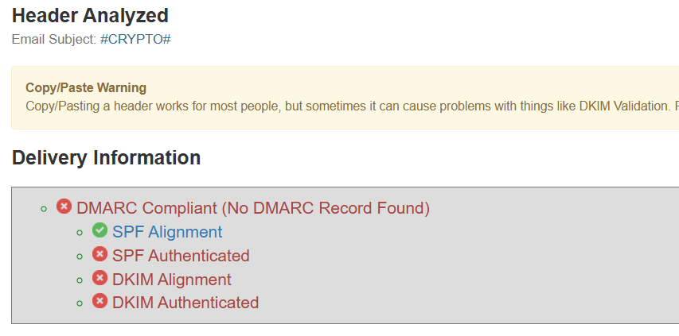
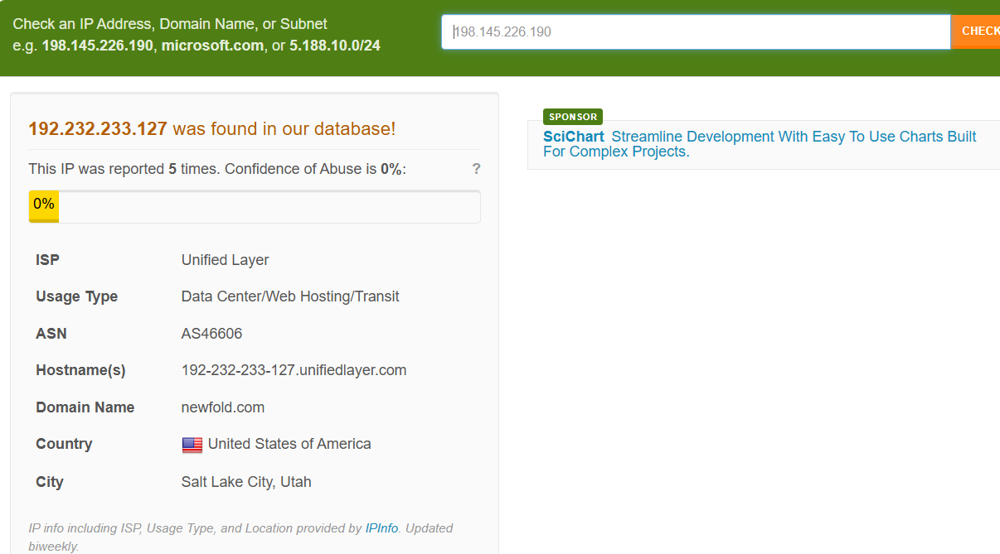
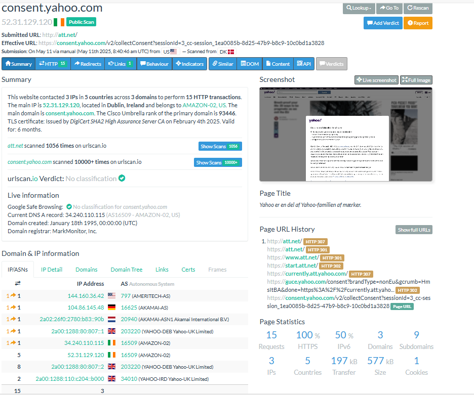
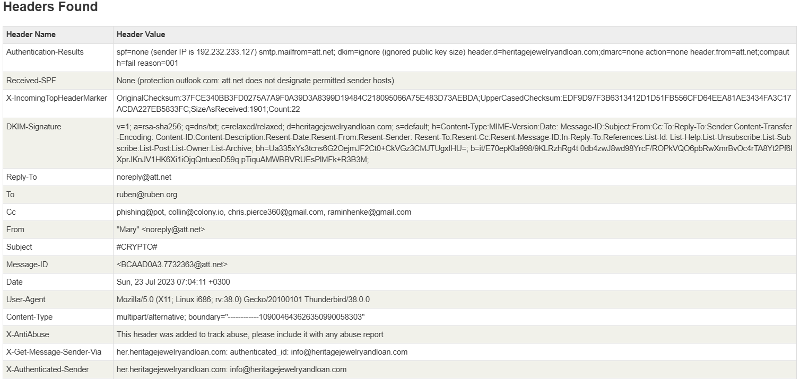

# 🚨 Phishing Email Analysis Report

> ⚠️ **WARNING**  
> Exercise caution with any links or attachments in this email. The sender address appears spoofed and contains suspicious elements.

---

## ✅ Step-by-Step Manual Email Analysis 

---
- [email source ](https://github.com/rf-peixoto/phishing_pot/blob/main/email/sample-1005.eml)
## 🔍 Initial Triage

- **Subject Line**: "#CRYPTO#" (Highly generic/suspicious subject)
- **Sender**: "Mary <noreply@att.net>" (Potential spoofing of AT&T domain)
- **Initial Checks**:
  - Email claims to be from AT&T but shows multiple red flags
  - Authentication checks failed:
  
    ```text
    Authentication-Results: 
      spf=none (sender IP is 192.232.233.127) 
      smtp.mailfrom=att.net; 
      dkim=ignore (ignored public key size) 
      header.d=heritagejewelryandloan.com;
      dmarc=none action=none
    ```
  - Sender IP: `192.232.233.127` (belongs to heritagejewelryandloan.com, not AT&T)
  - Contains suspicious Base64 encoded HTML content
  - Multiple recipients in CC field (spray-and-pray tactic)

While checking `192.232.233.127` reputation on `Abusedb` it shows `0` reputation

also `urlscan` did not show whether its malicious

---

## ✉️ Email Header Analysis

Key findings from the headers:

- **From**: "Mary <noreply@att.net>" (Display name doesn't match AT&T's typical format)
- **Return-Path**: `root@ubuntu-s-1vcpu-512mb-10gb-sfo3-01` (Indicates sent from a cloud server)
- **Reply-To**: `noreply@att.net` (Matches From address but still suspicious)
- **Message-ID**: `<BCAAD0A3.7732363@att.net>` (Format looks legitimate but could be spoofed)
- **Received**: Shows multiple hops through Outlook servers before reaching final destination
- **X-AntiAbuse**: Contains multiple headers suggesting the email was sent through heritagejewelryandloan.com
- **X-Sender-IP**: `192.232.233.127` (Matches sending IP)
- **X-Mailer**: Mozilla/5.0 Thunderbird/38.0.0 (Unusual for corporate email)
- **CC**: phishing@pot, collin@colony.io, chris.pierce360@gmail.com, raminhenke@gmail.com (which clearly indicate the phising target many victims)

---

## 📎 Attachment Analysis

- No traditional file attachments found
- Email contains Base64-encoded HTML content with suspicious image
- Decoded HTML reveals:
  - Obfuscated CSS styles (unusual for legitimate emails)
  - Hidden tracking image
  - Suspicious "#CURL#" placeholder that would likely be replaced with malicious URL in actual attack

---

## 🔗 URL and Link Analysis

- No visible links in plain text body
- HTML contains obfuscated code that would likely generate malicious links when rendered
- Image uses data URI scheme (base64 encoded) to avoid URL detection
- Potential redirection through "#CURL#" placeholder

---

## 📝 Email Body Analysis

- **Language**: Very minimal content (just "#CURL#"), highly suspicious
- **Impersonation**: Attempts to appear as AT&T email but fails authentication
- **Technique**: Uses minimal content to bypass filters, relies on HTML payload
- **Obfuscation**: Heavy use of CSS obfuscation and base64 encoding
- **Target**: Sent to multiple recipients (spray-and-pray approach)

---

## 🛠 Infrastructure Analysis

- **Sending Domain**: heritagejewelryandloan.com
- **Sending IP**: 192.232.233.127 (Linode LLC)
- **Tools Used**:
  - Exim mail server (version 4.91)
  - Sent from a Linux server (Ubuntu)
- **X-AntiAbuse Headers**: Indicate sender was authenticated as info@heritagejewelryandloan.com

---

## 🧾 Conclusion

This email is a **confirmed phishing attempt** based on:

- Failed SPF, DKIM, and DMARC authentication
- Spoofed sender address (AT&T)
- Obfuscated HTML content
- Suspicious sending infrastructure
- Lack of legitimate content
- Spray-and-pray recipient targeting

### ✅ Classification: **High Risk - Credential Phishing Attempt**

---

## 🔧 Recommended Actions

1. **Block Indicators**:
   - Sending IP: 192.232.233.127
   - Domain: heritagejewelryandloan.com
   - Email addresses: noreply@att.net (as used here), info@heritagejewelryandloan.com

2. **User Awareness**:
   - Educate users about identifying spoofed emails
   - Highlight the dangers of minimal-content emails with obfuscated HTML

3. **Technical Controls**:
   - Enhance email filtering for messages with:
     - Base64 encoded HTML
     - Mismatched From/Return-Path headers
     - Suspicious CSS obfuscation
   - Implement stricter DMARC policies

4. **Monitoring**:
   - Search logs for other emails from this IP/domain
   - Monitor for similar patterns in incoming mail

---

> **Note**: This email appears to be a test or incomplete phishing attempt, as the malicious payload ("#CURL#") wasn't activated. However, the infrastructure and techniques used indicate malicious intent.