## Investigate a Suspected Intrusion by the Notorious APT Group Volt Typhoon

### Scenario:
The SOC has detected suspicious activity indicative of an advanced persistent threat (APT) group known as Volt Typhoon, notorious for targeting high-value organizations. Assume the role of a security analyst and investigate the intrusion by retracing the attacker’s steps.

You have been provided with various log types from a two-week time frame during which the suspected attack occurred. Your ability to research the suspected APT and understand how they maneuver through targeted networks will be just as important as your Splunk skills.

## Initial Access

Volt Typhoon often gains initial access to target networks by exploiting vulnerabilities in enterprise software. In recent incidents, Volt Typhoon has been observed leveraging vulnerabilities in Zoho ManageEngine ADSelfService Plus, a popular self-service password management solution used by organizations.

**Q1.** Comb through the ADSelfService Plus logs to begin retracing the attacker’s steps. At what time (ISO 8601 format) was Dean's password changed and their account taken over by the attacker?  
To answer this question, we will leverage the keywords mentioned in the question: `Dean` and `password change`. Using a command query with these keywords, we can retrieve the answer.  
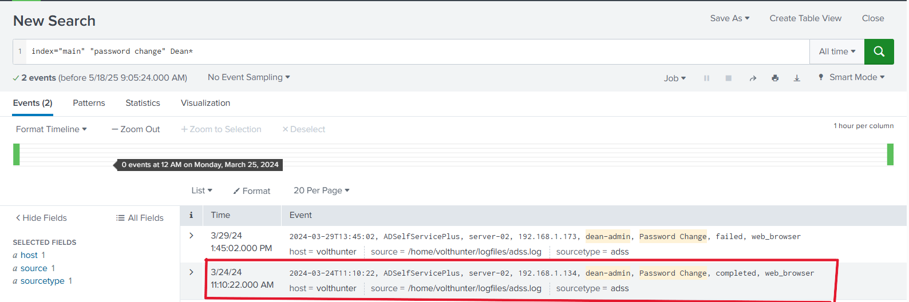

**Q2.** Shortly after Dean’s account was compromised, the attacker created a new administrator account. What is the name of the new account that was created?  
As observed, the attacker used the `wmic` tool. After a quick Google search on how accounts are created using `wmic`, we found the command `wmic useraccount create`.  
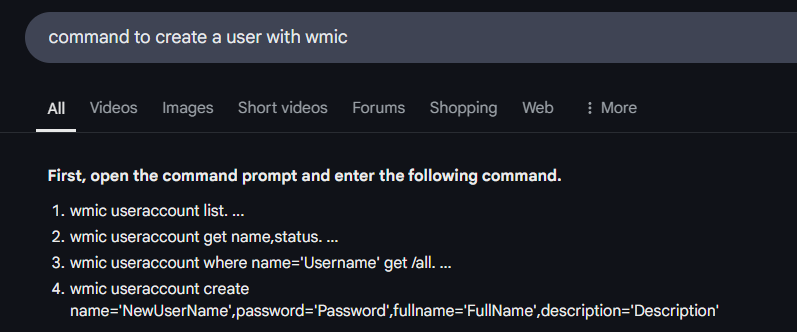  
Using this string in our Splunk search helped us identify the answer.  
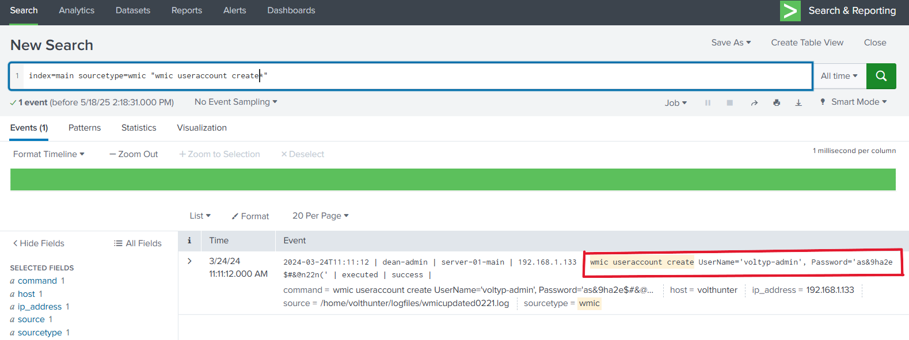

## Execution

Volt Typhoon is known to exploit Windows Management Instrumentation Command-line (WMIC) for a range of execution techniques. They leverage WMIC for tasks such as gathering information and dumping valuable databases, allowing them to infiltrate and exploit target networks. By using “living off the land” binaries (LOLBins), they blend in with legitimate system activity, making detection more challenging.

**Q3.** In an information-gathering attempt, what command does the attacker run to find information about local drives on server01 & server02?  
To answer this question, we searched using the keywords `server01 & server02`, which led us to the result.  
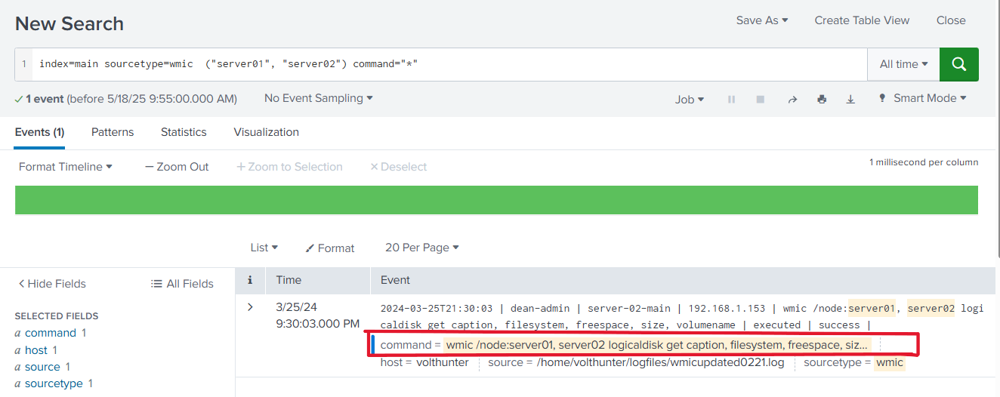

**Q4.** The attacker uses ntdsutil to create a copy of the AD database. After moving the file to a web server, the attacker compresses the database. What password does the attacker set on the archive?  
We searched for "ntdsutil" with the command:  
`index=main sourcetype=wmic "ntdsutil" command=*`  
It displayed a log with the following command:  
`wmic process call create "cmd.exe /c mkdir C:\Windows\Temp\tmp & ntdsutil.exe \"ac i ntds\" \"ifm create full C:\Windows\Temp\tmp\temp.dit\""`  

This command tells webserver-01 to:  
- Use 7-Zip to archive the file temp.dit  
- Split the archive into 100MB chunks  
- Encrypt it with a password  
- Create `cisco-up.7z` and related chunks  

This was likely done in preparation for data exfiltration. Therefore, we used the following command to search for the compression activity:  
`index=main sourcetype=wmic "temp.dit" command=*`  
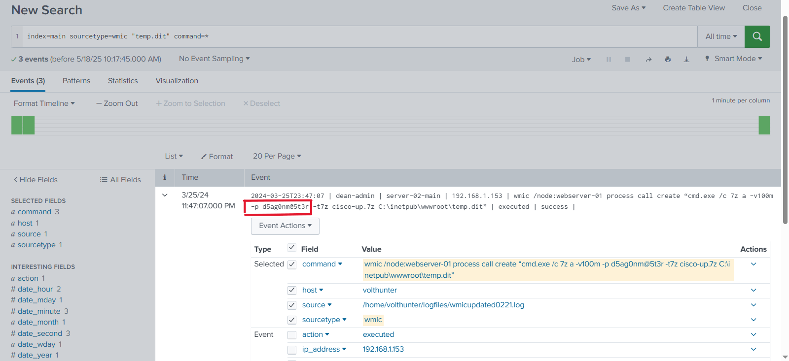

## Persistence

This APT group frequently employs web shells as a persistence mechanism. They disguise these web shells as legitimate files, enabling remote control over the server and allowing them to execute commands undetected.

**Q5.** To establish persistence on the compromised server, the attacker created a web shell using base64 encoded text. In which directory was the web shell placed?  
The attacker created a web shell on the server. After researching, I found that `certutil` was used for this task.  

## Defense Evasion

Volt Typhoon utilizes advanced defense evasion techniques to significantly reduce the risk of detection. These include purging files, deleting logs, and conducting reconnaissance of their operational environment.

**Q6.** In an attempt to cover their tracks, the attackers remove evidence of the compromise. They start by wiping RDP records. What PowerShell cmdlet does the attacker use to remove the “Most Recently Used” record?  
File deletion tasks such as log removal can be done using cmdlets like `Remove-ItemProperty`. I used this cmdlet in the query.  
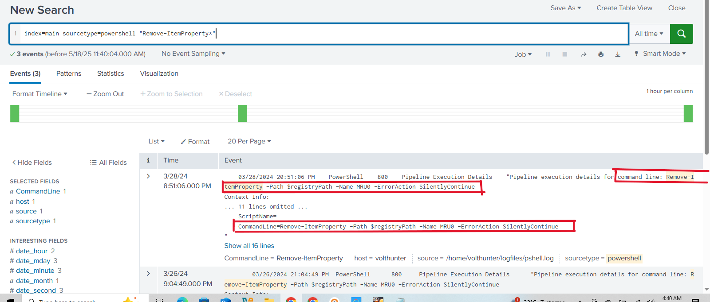

**Q7.** The APT continues to cover their tracks by renaming and changing the extension of the previously created archive. What is the file name (with extension) created by the attackers?  
I searched using the previous file extension `.7z`.  
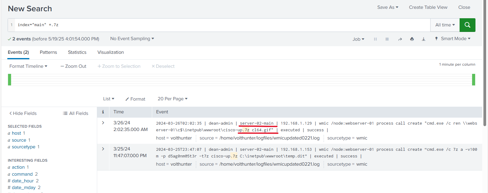

**Q8.** Under what regedit path does the attacker check for evidence of a virtualized environment?  
To answer this, I focused on the registry keyword `HKLM` in the search.  
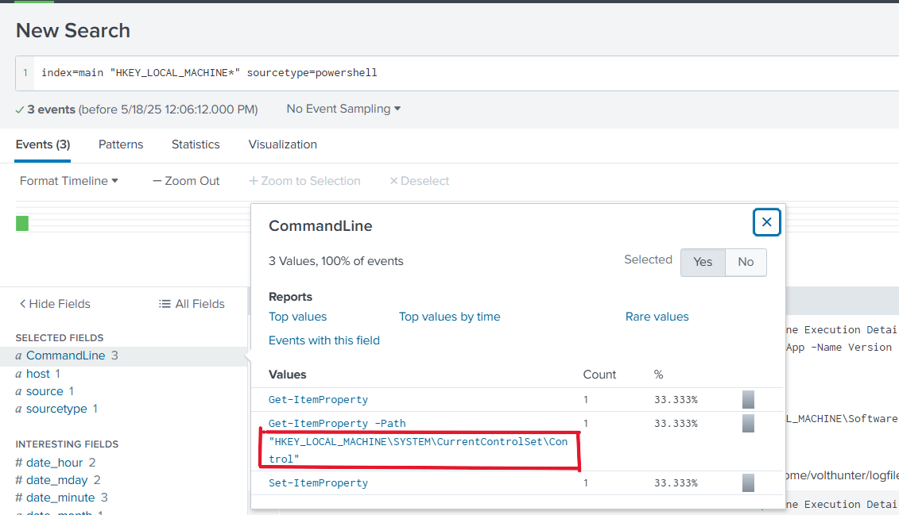

## Credential Access

Volt Typhoon often combs through target networks to uncover and extract credentials from various programs. They are also known to extract hashed credentials from system memory.

**Q9.** Using reg query, Volt Typhoon hunts for credentials. What three pieces of software do they investigate?  
**Answer Format:** Alphabetical order, separated by a comma and space.  
Using the `reg query` tool with `HKLM` in the search reveals the tools used.  
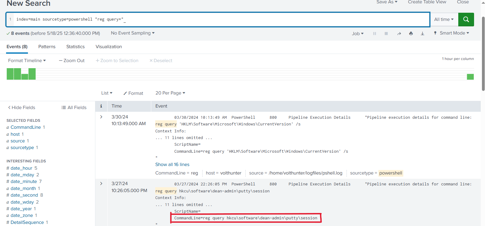  
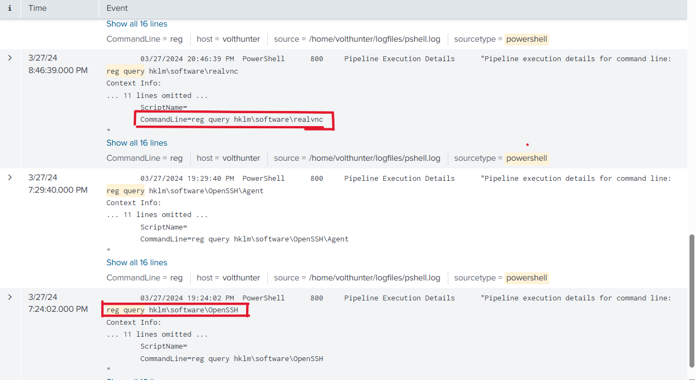

**Q10.** What is the full decoded command the attacker uses to download and run Mimikatz?  
In PowerShell, the `-E` flag is used for base64 decoding. We search for commands using this flag.  
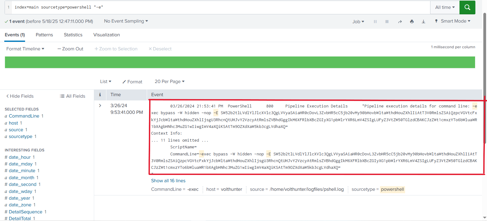  
We then decode the base64 string using tools like CyberChef.  
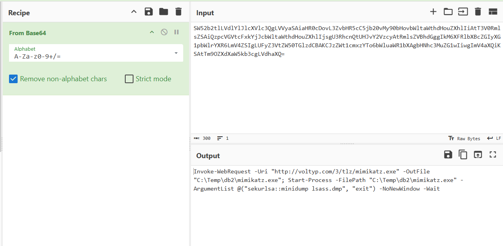

## Discovery

Volt Typhoon uses enumeration techniques to gather details about the network architecture, logging mechanisms, successful logins, and software configurations. This helps them gain a strategic understanding of the target environment.

## Lateral Movement

The APT has been observed moving previously created web shells to different servers as part of their lateral movement strategy. This allows them to maintain access across multiple systems.

**Q11.** The attacker uses `wevtutil`, a log retrieval tool, to enumerate Windows logs. What event IDs does the attacker search for?  
**Answer Format:** Increasing order, separated by a space.  
Searching for `wevtutil` helped uncover the relevant event IDs.  
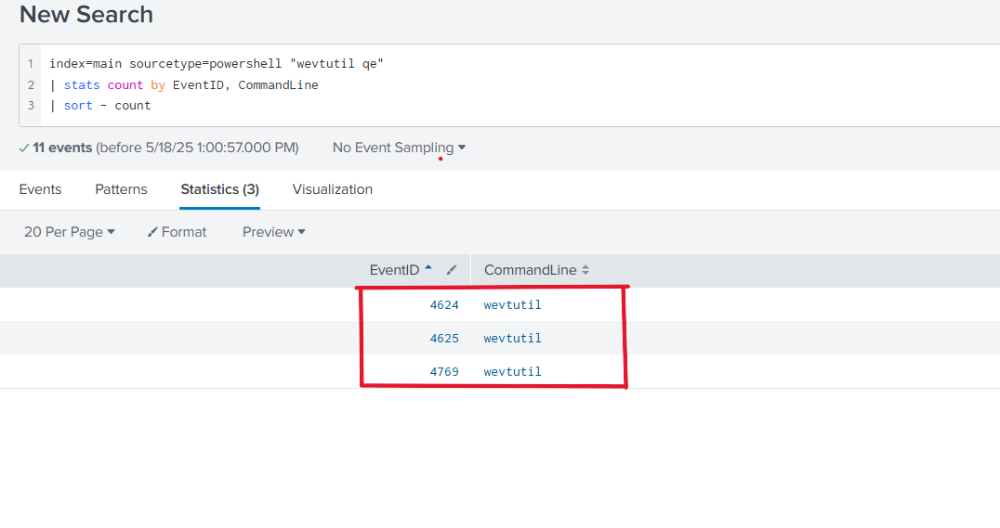

**Q12.** Moving laterally to server-02, the attacker copies the original web shell. What is the name of the new web shell that was created?  
The hint suggests using the original web shell name `iisstart.aspx` with the keyword `server-02`.  
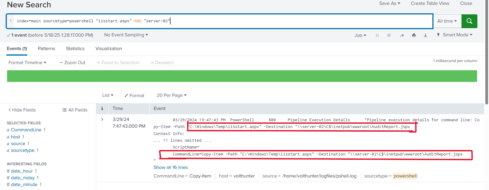

## Collection

During this phase, Volt Typhoon extracts sensitive data such as browser information and valuable assets.

**Q13.** The attacker locates valuable financial information. What three files does Volt Typhoon copy using PowerShell?  
**Answer Format:** Increasing order, separated by a space.  
The `Copy-Item` command is used to locate the copied files.  
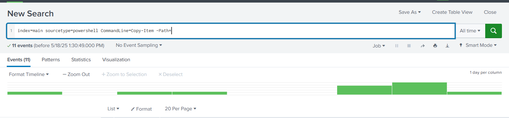  
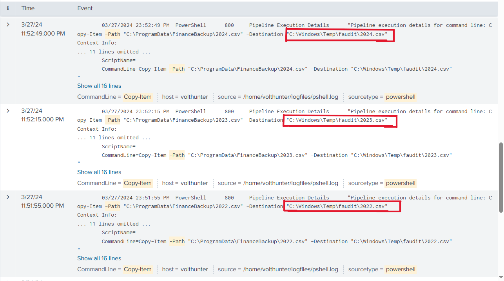

## C2

Volt Typhoon uses publicly available tools and compromised devices to establish covert command and control (C2) channels.

## Cleanup

To conceal their activities, the APT deletes event logs and removes artifacts of their operations.

**Q14.** The attacker uses `netsh` to create a proxy for C2 communications. What connect address and port do they use?  
**Answer Format:** IP Port  
Searching for the `netsh` command reveals the relevant connection details.  
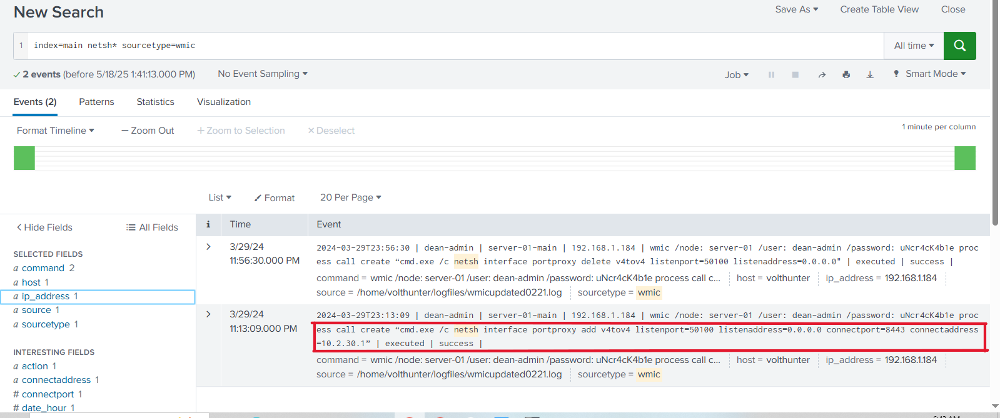

**Q15.** To hide their activities, what four types of event logs does the attacker clear on the compromised system?  
The logs cleared include: `Application`, `Security`, `Setup`, `System`.  
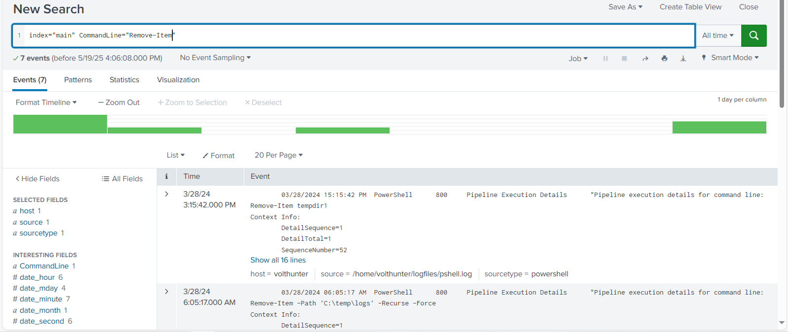

## Conclusion
This investigation into Volt Typhoon's activities highlights the importance of understanding APT tactics, techniques, and procedures (TTPs). By analyzing logs, retracing attacker steps, and correlating events across systems, we were able to identify key stages of the attack—from initial access to cleanup. Continuous monitoring, threat intelligence, and proactive threat hunting remain critical in defending against such sophisticated adversaries.