> 📝 **Note:** Whenever you're analyzing logs, packet captures, or any other data, it's easy to get overwhelmed. So before diving in, **slow down and ask yourself**:
>
> 1. **What exactly am I looking for?**  
>    Define your objective clearly — are you investigating a malware infection, a login anomaly, or a suspicious download?
>
> 2. **When did it happen?**  
>    Narrow the timeframe. A smaller window = less noise = faster answers.
>
> 3. **Where should I look?**  
>    Focus on the **relevant systems, hosts, networks, or protocols**. Ignore data from unrelated sources.
>
> 4. **What can I safely ignore?**  
>    Filter out anything that’s normal, known-good, or unrelated. This is crucial. Don’t waste time staring at logs that don’t matter.
>
> Focus on what matters, filter out what doesn’t. The more you narrow down your search, the faster and more accurate your analysis will be.

---

## Event Viewer

Ever felt like you’re drowning in a sea of logs? Event Viewer is your life raft. It’s Windows’ built-in diary, recording everything from "Oops, I crashed" errors to "Someone’s trying to break in!" alerts. Let’s break it down without the jargon overload.
its a built-in Windows tool that shows detailed records of everything happening on your computer  like logins, software errors, security warnings, and system changes. It helps you monitor, troubleshoot, and investigate suspicious or unwanted activity by showing these events in organized logs.

You can use it to:
- Check for system or app errors
- Track logon attempts
- Investigate possible attacks
- Review system performance

### 🚫 What Windows Doesn’t Log by Default (but you probably want it to)

👉 **1. PowerShell Commands Executed**  
Windows won’t log what exact commands someone runs in PowerShell.  
✅ To fix: Enable PowerShell Module Logging and Script Block Logging in Group Policy.

👉 **2. CMD (Command Prompt) Commands**  
It doesn’t log what someone typed in the command prompt.  
✅ To fix: Use Sysmon or enable detailed command-line logging via Audit Process Creation.

👉 **3. Script Executions (like .ps1, .bat, .vbs)**  
Running scripts doesn’t always generate detailed logs.  
✅ To fix: Turn on Script Block Logging and enable Audit Process Creation with command line.

👉 **4. Registry Changes**  
Modifying the registry won’t show up in the logs by default.  
✅ To fix: Enable Object Access auditing, and use tools like Sysmon for detailed monitoring.

👉 **5. File Access (who opened, copied, or deleted files)**  
You won’t see who accessed or deleted sensitive files unless you tell Windows to watch them.  
✅ To fix: Enable Object Access auditing, and set file/folder audit rules in the file properties.

👉 **6. USB Device Insertion**  
Plugging in USB drives isn't always logged clearly.  
✅ To fix: Enable Removable Storage Audit or use Sysmon for better tracking.

👉 **7. Network Connections (like who connected where)**  
You won’t get logs of outgoing/incoming connections unless you enable advanced logging.  
✅ To fix: Use Sysmon (Event ID 3) or enable Windows Firewall logging.

👉 **8. Scheduled Tasks Created or Modified**  
Malware often uses scheduled tasks, but Windows won’t alert you by default.  
✅ To fix: Enable Task Scheduler Operational Logs and Audit Other Object Access Events.

---

### Exploration

Let's explore the components and features of `Event Viewer`.  
Once you open the Event Viewer you will be greeted with a homepage like this:  
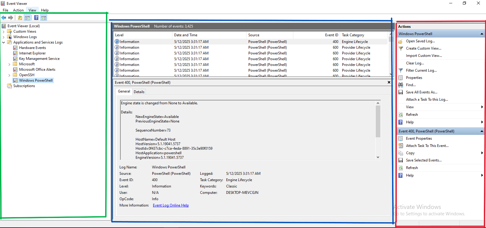

The home page is divided into 3 panes:

1. The pane on the **left (green)** provides a hierarchical tree listing of the event log providers.  
2. The pane in the **middle (blue)** displays a general overview and summary of the events specific to a selected provider.  
3. The pane on the **right (red)** is the actions pane.

From the above, we can see some options in the menu, such as `File`, `Actions`, `View`, and `Options`.

#### Actions

The `Actions` options can change before and after you select an event.

**Before selecting an event** it will look something like:  
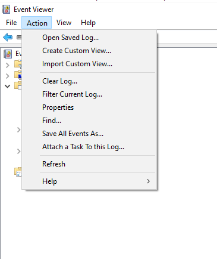

Fields include:
- **Open Saved Log...** – Load a previously saved event log file (.evtx) for review.
- **Create Custom View...** – Filter and create a personalized view of specific event types.
- **Import Custom View...** – Load a custom view from an exported XML file.
- **Clear Log...** – Erase all events from the selected log (you can save before clearing).
- **Filter Current Log...** – Show only events matching certain criteria (like Event ID, level, date).
- **Properties** – View or edit log settings, like log size and overwrite policy.
- **Find...** – Search for specific keywords or Event IDs in the current log.
- **Save All Events As...** – Export the current log to a file (.evtx, .xml, .txt, or .csv).
- **Attach a Task To this Log...** – Set up an automatic action (like sending an email) when an event occurs.
- **Refresh** – Reload the log to display the latest events.
- **Help** – Open Windows help related to Event Viewer.

**After selecting a particular event**, it will show:  
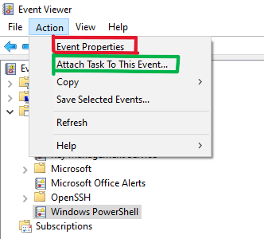

Options include:
- **Event Properties** (🔴 Red box) – View full details about the selected event.
- **Attach Task To This Event...** (🟢 Green box) – Create an automated task when this event occurs again.
- **Copy** – Copy event details to clipboard.

#### Attach Task To This Event...

It provides steps to schedule a task when a specific event occurs.  
Example: If privilege is escalated, you can run a task to isolate the system.  
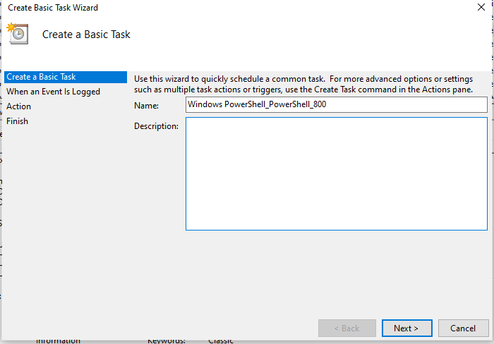

---

### View

The view options help configure how events are displayed.  
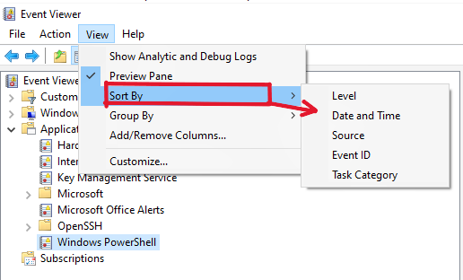

**View > Sort By**:
- **Level** – Error, Warning, Info
- **Date and Time**
- **Source**
- **Event ID**
- **Task Category**

**View > Add/Remove Columns**  
Use this to customize which event details appear in the preview pane.  
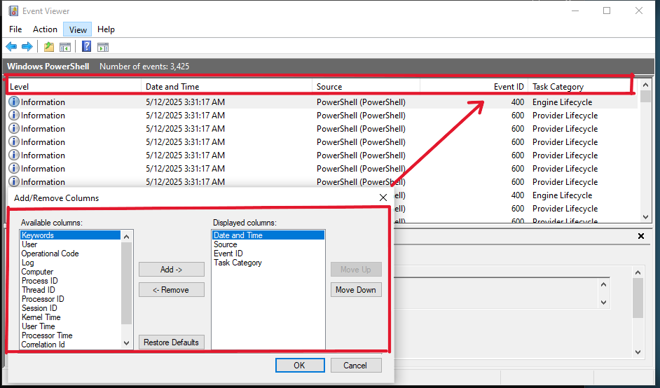

**View > Show Analytics and Debug Logs**  
Enable this to view hidden logs like debugging data.  
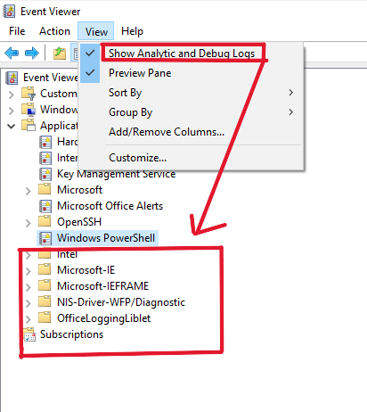

**View > Preview Pane**  
Shows detailed info of selected event.  
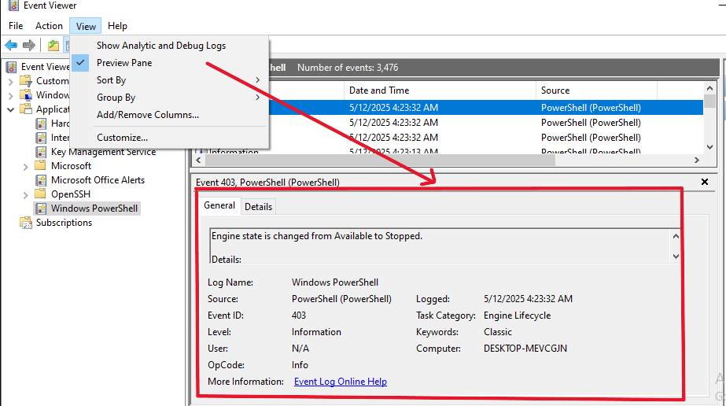

---

## Log Analysis

Let's begin diving into some logs:

### 1. Windows Logs
- Application
- System
- Security
- Setup
- Forwarded Events

### 2. Applications and Services Logs
Logs from specific apps like PowerShell, etc.

---

### Security Events

Common Event IDs:
- `4624`: Successful Logon  
- `4625`: Failed Logon  
- `4634`: Logoff  
- `4672`: Privileged Logon  
- `4688`: Process Creation  
- `4697`: Service Installation  
- `4720–4767`: User & Group Management  
- `4719`: Audit Policy Change  
- `4663`: Object Access  
- `5156`: Network Connection Allowed

---

### Filtering

Use filters from the Actions pane to narrow logs by ID.

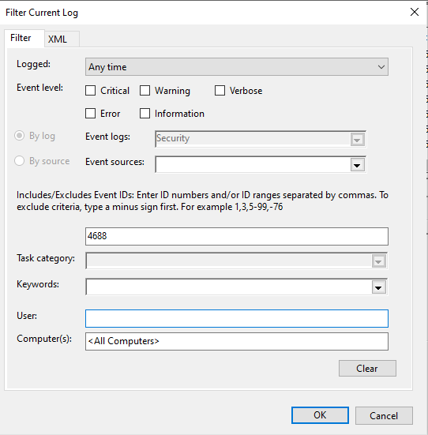

Example:  
#### Successful Logon (ID: 4624)  
Filters for `4624` under Security Logs show all successful logins.  
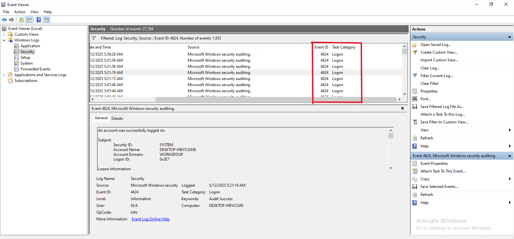

---

## Hunting for Bad Guys with Event Viewer

Now that you understand the Event Viewer basics, let’s hunt threats.

Attackers often:
- Create scheduled tasks
- Add registry keys for persistence

### Key Events for Persistence

- **4697**: A service was installed (Security Log)
- **7045**: A new service was installed (System Log)

Example screenshot for 7045:
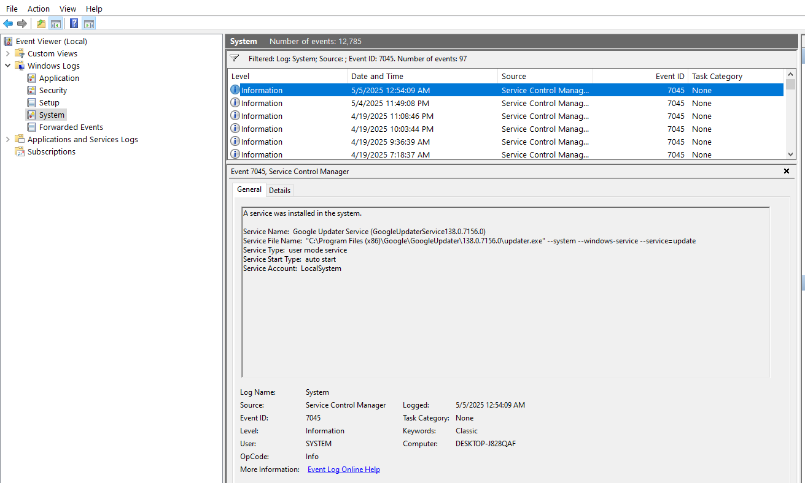

### Manual Correlation Strategy

- Combine `4688` (process creation) with `5156` (network connection).
- Watch for suspicious parent/child processes (e.g., Word spawning PowerShell).
- Use Sysmon for detailed logs like DNS queries and file hashes.

---
# Persistence Mechanisms via Event Logs

Persistence is a critical post-exploitation technique that allows attackers to maintain access to compromised systems. Monitoring specific event logs can help detect such persistence mechanisms.

---

## 1. Event ID 4697 - Service Installed

- **Description**: A new service was installed on the system.
- **Log Source**: **Security Log**
- **Significance**: Indicates a potentially malicious service being installed to maintain persistence. This could be a legitimate system or admin operation, or it could indicate attacker activity.

---

## 2. Event ID 7045 - New Service Installed

- **Description**: A new service was installed on the system.
- **Log Source**: **System Log**
- **Significance**: Similar to 4697, this tracks the installation of new services, which attackers often use for persistence or privilege escalation.

---

## 3. Event ID 106 - Scheduled Task Registered

- **Description**: A new scheduled task was created.
- **Log Source**: **Microsoft-Windows-TaskScheduler/Operational Log**
- **Significance**: Scheduled tasks can be used by attackers to run malicious payloads periodically or at system startup.

---

## 4. Event ID 13 - Registry Value Created

- **Description**: A registry value was created.
- **Log Source**: **Sysmon Log**
- **Significance**: Registry values can be added to configure persistent behavior, such as loading malware at startup.

---

## 5. Event ID 12 - Registry Object Created or Deleted

- **Description**: A registry key or value was created or deleted.
- **Log Source**: **Sysmon Log**
- **Significance**: Monitors changes to registry keys that could indicate attempts at maintaining persistence or manipulating system behavior.

---

## Network Connections

Attackers typically do not remain on a single compromised system. They move laterally through the network using tools like PsExec, PowerShell remoting, or RDP.

Monitoring the following events can help detect such activity:

| **Event ID** | **Description**                                       | **Log Source** |
|--------------|-------------------------------------------------------|----------------|
| 5156         | Windows Filtering Platform allowed a connection       | Security       |
| 4648         | Logon with explicit credentials                       | Security       |
| 5140         | Shared object accessed                                | Security       |

These logs help trace the flow of traffic, credential usage, and access to shared resources across systems.

---

## Application and Service Logs

These logs include entries from services such as SSH, PowerShell, and others. Reviewing these logs helps identify unauthorized or suspicious activity.

### SSH Logs

If you suspect that SSH was used to log into your system, examine SSH-related logs under **Application and Services Logs**.

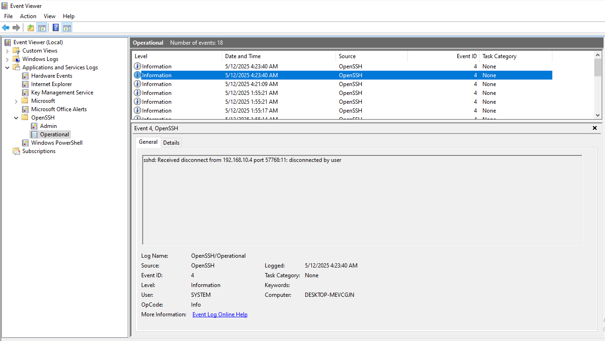

As shown above, this log entry indicates an SSH connection received from a specific IP address, which, in this case, is a legitimate connection from another one of my machines.

---

### PowerShell Logs

PowerShell is widely abused by attackers for reconnaissance, lateral movement, and payload execution. Enabling detailed PowerShell logging allows you to capture every command executed.

- **Path to logs**:  
  `Application and Services Logs > Microsoft > Windows > PowerShell > Operational`

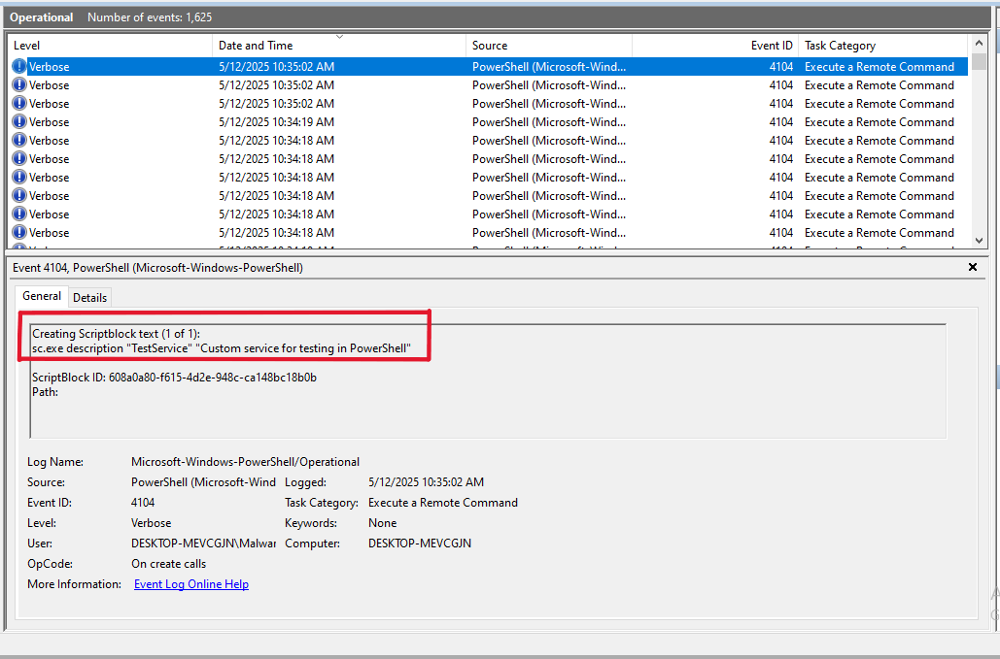

In the screenshot above, the highlighted entry shows the specific command that was executed, providing valuable insight into attacker behavior.

Additionally, under the **Windows** directory in Event Viewer, you will find logs for various built-in applications. These are valuable sources for deeper investigation based on specific use cases.

---

## Alerts and Real-Time Monitoring

For continuous monitoring and detection, use tools that aggregate logs and generate alerts:

### Tools:

- **Event Viewer** → Create **Custom Views** to filter for specific Event IDs.
- **Task Scheduler** → Trigger actions based on log entries (e.g., alert or script execution).
- **Sysinternals Sysmon** → For detailed event tracking.
- **SIEM tools**:
  - **Splunk**
  - **Wazuh**
  - **Elastic Stack**

These tools centralize and correlate logs, making it easier to detect anomalies, investigate events, and respond to threats in real time.

---

> 🛡️ Monitoring event logs is an essential part of defending against persistence techniques. Being aware of what logs to monitor and how to interpret them can greatly increase your chances of detecting and disrupting attacker activity.

## Final Thought
Event Viewer is like a security camera for your PC. The more you tweak it (enabling logs, filtering noise), the clearer the footage gets.Therefore this is just a fraction of what we can do with it. take time to explore it more.

**`Your Homework`: Enable Sysmon, import the SwiftOnSecurity config (Google it!), and watch your logs become 10x more useful**

