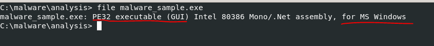
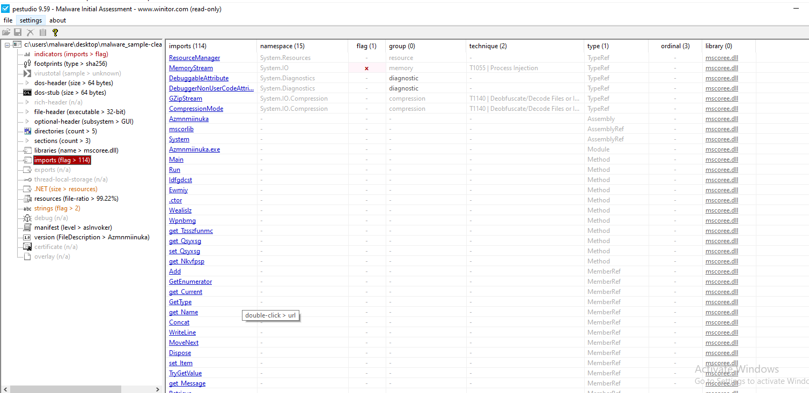

> ⚠️ **WARNING: Do Not Run Malware Samples on Your Personal Machine!**
>
> Always perform malware analysis in a **controlled sandbox environment** such as a **Virtual Machine (VM)** dedicated solely for malware analysis. Running suspicious or malicious files on your host system can result in severe consequences, including:
>
> - Data loss or corruption
> - Credential theft
> - Network compromise
> - Permanent damage to your operating system
>
> For this analysis, I used a **virtual machine** specifically set up for malware research. Please **do not run any malware samples directly on your main or production system**. Use tools like **VirtualBox**, **VMware**, or online sandboxes like **Any.Run**, **Joe Sandbox**, or **Cuckoo Sandbox**.
>
> **Stay safe, be responsible.**

## Phase 1: Preparation

### **Establish a Secure Lab Environment**
Set up an isolated VM environment using tools like VirtualBox, VMware, Cuckoo Sandbox, or INetSim with host-only networking. Be sure to take snapshots of the VM state.

Next, **Hash and Backup the Sample**. You can use tools such as `ComputeHash` or any other of your choice.  
**Note:** Always generate and store hashes (MD5, SHA1, SHA256) for integrity and identification.

> For this analysis, I used `ComputeHash` to generate the hash.

---

## Phase 2: Static Analysis (Basic)

After taking the hashes, the next step is to **Identify the File Type and Metadata**. You can use tools such as `file`, `binwalk`, `TrID`, or any other tool of your choice. The goal is to understand the file type, metadata, and whether the file is compressed or packed.

> **Note:** I will be using different tools for demonstration. I encourage you not to rely on a single tool for analysis — tools behave differently and can reveal different aspects of the sample. Always dig deeper and leave no stone unturned.

### File Type Analysis

#### Using `TrID`:

As shown above, `TrID` identifies the file as a .NET executable. This suggests the file was written in a .NET language (like C# or VB.NET) and compiled into Common Intermediate Language (CIL), intended to run on the .NET framework or Mono.

#### Using `binwalk`:

Here, `binwalk` revealed an embedded compressed file within the main malware sample! We extracted the embedded file and found its name to be `71C`. We will analyze it separately to understand its contents.

> **Note:** This demonstrates the advantage of using multiple tools — if we had only used `TrID`, we would have missed the embedded file.

#### Using `file`:

This further confirms that we are dealing with a Portable Executable (PE) file.

### Analyzing the Extracted `71C` File

#### Binwalk Result:

The `71C` file appears to be a Microsoft PE executable.

#### Using `TrID` on `71C`:

According to `TrID`, this is a `.DLL` — a .NET Dynamic Link Library. This means it’s a .NET assembly written in C# or VB.NET and is not a standalone executable but a library meant to be used by other programs or loaded by the .NET runtime.

> As we can see, combining data from different tools gives a much clearer picture of what we're dealing with.

---

### Strings Extraction on `71C`

Running the `strings` command on `71C` returned many results. The most useful strings can be categorized as follows:

#### 📁 File/Process/System Interaction
- **Methods:** `ReadAllBytes`, `WriteAllText`, `WriteAllBytes`, `GetFileName`, `GetDirectoryName`, `Kill`, `Sleep`, `Start`, `WaitForExit`, `Path.Combine`
- **Purpose:** File handling, launching/killing processes, delaying execution.

#### 🌐 Network Capabilities
- **Methods:** `DownloadData`, `ServicePointManager`, `set_SecurityProtocol`
- **Purpose:** Likely used to download additional stages or commands.

#### ⏰ Scheduled Task Creation
- **Methods:** `RegisterTaskDefinition`, `get_Triggers`, `set_ExecutionTimeLimit`, `set_DisallowStartIfOnBatteries`, `set_StopIfGoingOnBatteries`
- **Purpose:** Setting up Windows Scheduled Tasks for persistence or timed execution.

#### 🧠 Reflection & Runtime Code Generation
- **Methods:** `DefineMethod`, `CreateType`, `InvokeMember`, `DynamicInvoke`, `GetConstructor`, `GetFunctionPointer`, `System.Reflection.Emit`
- **Purpose:** Possibly creating and executing code at runtime — a common obfuscation or evasion tactic in .NET malware.

#### 🔐 Encryption/Decryption
- **Methods:** `get_Key`, `get_IV`, `set_KeySize`, `set_BlockSize`, `ReadByte`, `ReadInt16`, `Buffer.BlockCopy`
- **Purpose:** Working with encryption — may decrypt payloads or securely exfiltrate data.

#### 🛡️ Security Bypass / Anti-analysis
- **Methods:** `SkipVerification`, `SecurityPermissionAttribute`, `DebuggerBrowsableAttribute`, `DebuggerNonUserCodeAttribute`
- **Purpose:** Attempting to disable code verification or hide code from debuggers.

#### 📦 Serialization / Code Contracts
- **Methods:** `System.Runtime.Serialization`, `ProtoContractAttribute`, `ProtoMemberAttribute`
- **Purpose:** Structured data exchange — potentially for C2 communication or configuration.

#### 🧰 Environment and User Info
- **Methods:** `get_UserName`, `get_OSVersion`, `get_Is64BitOperatingSystem`, `SystemInformation.get_PrimaryMonitorSize`
- **Purpose:** Gathering system information — typical in malware reconnaissance.

What caught my attention at the end of the strings output is the list of imported DLLs.

---

### Extracting Strings from the Main Sample

The main malware sample also returned several interesting strings. Here’s how I categorized them:

#### 🔧 .NET Metadata
- `BSJB` — Signature for .NET assemblies.
- `v4.0.30319` — Target .NET runtime version.
- `mscoree.dll`, `_CorExeMain` — Entry point used by Windows to run .NET binaries.

#### 🧰 Malware Modules or Commands
- `DownloadFileCommand`
- `GzipWithHeaderDecompressionCommand`
- `LoadAndExecuteAssemblyCommand`

> These suggest the malware can:
> - Download additional files
> - Decompress payloads
> - Load and execute other assemblies (possibly reflectively or in-memory)

#### 📁 File and Resource Handling
- `ReadSizeHeader`, `ReadFully`, `MemoryStream`, `Byte`, `Stream`
- `Zongpj.Properties.Resources.resources`, `ResourceManager`

> These relate to:
> - Handling file-like streams
> - Reading embedded or external resources (e.g., configs or payloads)

#### 🧬 Reflection & Dynamic Code Execution
- `Invoke`, `GetTypeFromHandle`, `GetMethod`, `MethodInfo`, `RuntimeTypeHandle`, `BindingFlags`

> These show the malware dynamically loads and executes code — useful for evasion and modular loading.

#### 🔐 Obfuscation or Junk Data
- Obfuscated names like `Wajsqnpa`, `Kgiuhkwdb`, `Xranwf`, `Tzsszfunmc`

> These are likely randomized class, method, or variable names — common in malware packed with tools like ConfuserEx.

#### 🌍 Localization / Culture Info
- `CultureInfo`, `set_Culture`, `resourceCulture`

> While typical in .NET applications, malware can use these for:
> - Customizing behavior per region/language
> - Switching payloads based on locale

---

## VirusTotal Analysis

Before diving into dynamic analysis, I submitted the sample hash to VirusTotal.

The result shows that this is a known malware sample. Let's dig deeper into what VirusTotal reveals.

### Basic Info

Under the "Details" tab, we see:
- File hashes
- First submission date
- Malware signature and name
- Additional metadata

### Relations

In the "Relations" tab, we find the IPs and domains the malware contacted during execution. This is based on dynamic analysis performed by VirusTotal.

> This type of information is only available through dynamic analysis, which we will later confirm.

### Behavior and MITRE Mapping

In the "Behavior" tab, we observe:
- Network communications
- File system actions
- MITRE ATT&CK techniques used by the malware

These results come from previous dynamic analyses submitted by other users. We will confirm and expand upon them in our own dynamic analysis phase.

---

## Phase 3: Static Analysis (Advanced)

### 🔐 Detect Packing/Obfuscation

It's very important to check whether the PE file you're analyzing is packed or obfuscated. Packed files can hinder analysis or reverse engineering. Malware authors use packing to make their code harder to examine. If a file is packed, it must be **unpacked** first, as analyzing a packed file will not yield reliable results.

To determine if the file is packed, we use **Exeinfo PE**.

Based on the Exeinfo PE scan results above, the file appears to be **packed or obfuscated**:

- **Language/Framework Info**: `MS Visual C# / Basic.NET / MS VB 2005 [Obfus/Crypted]`
  - This indicates the file is a .NET executable and has likely been obfuscated or packed.
- **Packer/Obfuscator**: Detected as "Obfus/Crypted" (not UPX)
  - For unpacking, we'll use `de4dot` – a popular .NET deobfuscator.

After unpacking with `de4dot`, we obtain a clean, unpacked PE file:

Now that we have an unpacked sample, we can proceed with further static analysis using tools such as:
- PEStudio
- CFF Explorer
- Ghidra
- IDA Pro

---

### 🛠 Analyze Imports & APIs

#### Tools: PEStudio, CFF Explorer

---

### 🔍 CFF Explorer

When we open the **unpacked PE file** in CFF Explorer, we can view several key details like the actual name, size, file type, version info, and more:

Navigating through the sections in CFF Explorer provides more insight. For example, when we look at the **import table**, we can match DLLs found in our earlier **strings extraction**:

We can also view other metadata such as the program name:

> ⚠ Unfortunately, we can't cover all information here. Take your time to explore the tool and learn more.

---

### 📘 PEStudio

When you open the unpacked file in **PEStudio**, you’ll be greeted with a dashboard like the one below:

From this, we can gather useful information:

- The file is **executable**
- The **entropy** gives insight into whether data is compressed or encrypted
- **Subsystem: GUI** — Indicates that the executable has a graphical user interface
- **Timestamp / Compilation Date** — Though this can be forged by malware authors
- **Digital signature info** — Confirms if the file is signed or not

---

### 🧱 PE Sections Overview

A PE (Portable Executable) file (like `.exe` or `.dll`) is structured into sections — think of it like a **lunchbox** where each compartment has its role:

| Section Name | What's Inside                            | Simple Meaning                                  |
|--------------|------------------------------------------|--------------------------------------------------|
| `.text`      | Program code (machine instructions)       | 🧠 The brains of the program                     |
| `.data`      | Global/static variables                   | 🧾 Saved values the program needs while running |
| `.rdata`     | Read-only data (e.g. strings/constants)   | 📚 Info the program uses but doesn’t change     |
| `.rsrc`      | Resources (icons, dialogs, images)        | 🎨 Visual elements packed in the EXE            |
| `.reloc`     | Relocation data                           | 🛠 Helps the program load properly in memory    |
| `.edata`     | Export table                              | 📤 Functions it exposes (if it's a DLL)         |
| `.idata`     | Import table                              | 📥 Functions it calls from Windows libraries    |

Malware may:
- Hide code in **unusual or custom-named sections**
- Add **extra sections**, encrypt `.text`, or use **fake imports**

---

### ⚠ PE Characteristics and Suspicious Behavior

From the PEStudio scan:

- The file has write and share permissions, and may be **self-modifying** — a red flag for malware behavior.
- Extra or renamed sections may indicate custom packers or hidden payloads.

---

### 🧵 Import Libraries & Strings

We see a list of libraries (DLLs) the PE imports and uses.

> ⚠ Some malware intentionally imports libraries that it **does not use** to mislead analysts — known as **fake imports**. Always validate which ones are actually called in the code.

---

### 🔠 Strings and Their Locations

These are imported strings along with their **corresponding memory locations**.

This concludes our basic static analysis phase. There's still much more to explore, so take your time to dive into these tools and become familiar with how they present information.

---

### ⏭️ Next Phase

We’ll cover **Disassembly/Decompilation** in the [`Dynamic Analysis`](dynamic.md) section.

Let’s not make this too long see you there! Hope you enjoyed and learned something valuable so far.

> *To be continued with dynamic analysis...*
